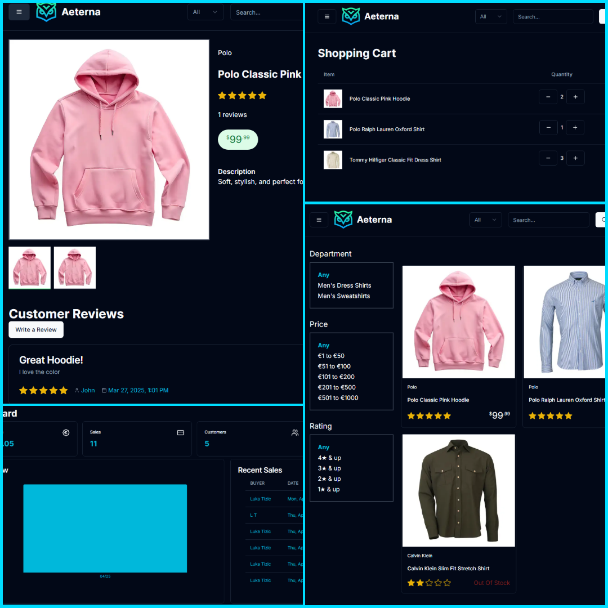

<div style="text-align: center; font-family: 'Arial', sans-serif; padding: 50px 0; background: linear-gradient(135deg, #6a11cb, #2575fc); color: #fff;">
  <h1 style="font-size: 3rem; font-weight: bold; letter-spacing: 2px;">Welcome to Aeterna!</h1>
  <p style="font-size: 1.25rem; margin: 20px 0; font-style: italic;">A sleek eCommerce app built with Next.js — crafted to explore modern web development and UI design.</p>
  <a href="https://aeterna-ecommerce.vercel.app/" style="text-decoration: none; color: #fff; font-size: 1.2rem; background-color: #2575fc; padding: 10px 20px; border-radius: 30px; box-shadow: 0 4px 6px rgba(0, 0, 0, 0.2); transition: background-color 0.3s ease;">
    🛒 Demo Link
  </a>
  <hr style="width: 50%; border: 1px solid #ddd; margin: 40px auto; opacity: 0.5;">
</div>

```bash
npm run dev
# or
yarn dev
# or
npm dev
# or
bun dev
```


<div style="max-width: 800px; margin: 0 auto; text-align: center; font-family: 'Arial', sans-serif; padding: 40px 20px; color: #fff;">
  <h2 style="font-size: 2rem; font-weight: bold; margin-bottom: 20px;">Tech Stack</h2>
  <p style="font-size: 1.1rem; margin-bottom: 30px; font-style: italic;">
    Built using modern web technologies and tools to deliver performance, reliability, and a polished user experience.
  </p>
  <ul style="list-style: none; padding: 0; display: grid; grid-template-columns: repeat(auto-fit, minmax(180px, 1fr)); gap: 10px; text-align: left;">
    <li>⚛️ React v19</li>
    <li>🔼 Next.js v15</li>
    <li>🟦 TypeScript</li>
    <li>🧹 ES Lint</li>
    <li>🐘 PostgreSQL</li>
    <li>🛠️ Prisma</li>
    <li>🧪 Jest</li>
    <li>🛡️ Zod</li>
    <li>🔐 Next Auth</li>
    <li>🧾 React Hook Form</li>
    <li>💳 PayPal & Stripe API</li>
    <li>🎨 Tailwind CSS</li>
    <li>🧩 ShadCN UI</li>
    <li>📊 Recharts</li>
  </ul>
</div>

<hr>

[](https://aeterna-ecommerce.vercel.app/)


<hr>
